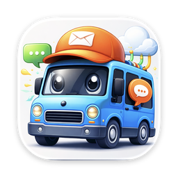
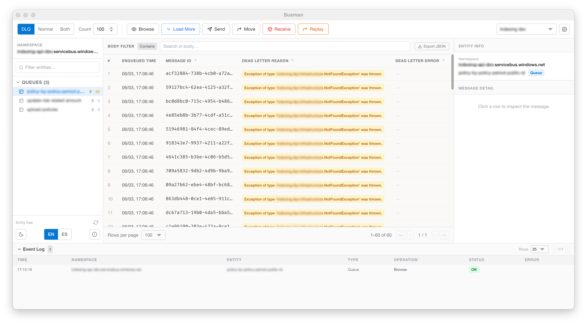

<p align="center">
  
</p>

# Busman

A desktop client for managing Azure Service Bus queues and topics.

Browse messages, inspect payloads, send test messages, move dead letters back to their queues, and drain queues — all from a native desktop window without writing any code or using the Azure Portal.



---

## Platforms

| Platform | Architecture | Format |
|----------|-------------|--------|
| Windows  | x64 | `.msi` installer / portable `.exe` |
| macOS    | Apple Silicon (M1/M2+) | `.dmg` |
| Linux    | x64 | `.AppImage` |

---

## Getting Started

1. Download the installer for your platform from the [Releases page](https://github.com/matiaspalomeque/busman/releases).
2. Install and open Busman (see [Running on macOS](#running-on-macos) if the app is blocked).
3. Click the **settings icon** (top-right) to open **Manage Connections**.
4. Add a connection by pasting your Azure Service Bus connection string and giving it a name.
5. Use **Test Connection** to verify the connection string is valid before saving.
6. Set the connection as active — the sidebar will populate with your queues and topics.

---

## Running on macOS

Busman is not signed with an Apple Developer certificate, so macOS Gatekeeper will block it the first time you try to open it. Here's how to run it:

### Option 1 — Right-click to open (recommended)

1. Open **Finder** and navigate to the **Applications** folder (or wherever you dragged the app from the `.dmg`).
2. **Right-click** (or Control-click) on **Busman.app**.
3. Select **Open** from the context menu.
4. A dialog will warn that the app is from an unidentified developer. Click **Open**.
5. You only need to do this once — after that, Busman opens normally.

### Option 2 — System Settings

1. Try to open Busman normally (double-click). macOS will block it.
2. Go to **System Settings → Privacy & Security**.
3. Scroll down to the **Security** section. You will see a message saying Busman was blocked.
4. Click **Open Anyway** and confirm.

### Option 3 — Terminal

If the options above don't work, you can remove the quarantine flag manually:

```bash
xattr -d com.apple.quarantine /Applications/Busman.app
```

Then open the app normally.

---

## Features

### Connection Profiles

Save multiple named connections and switch between them at any time. Connections are stored locally on your machine and sorted alphabetically for quick access. You can set one as the active connection, which is used for all operations.

Use **Test Connection** to validate your connection string before saving — Busman will confirm it can reach the namespace or show the specific error.

### Entity Browser

The left sidebar lists all **Queues** and **Topics** (with their subscriptions) in the connected namespace. Each entity shows its **active and dead-letter message counts** so you can spot backlogs at a glance. Use the filter box to search by name. Click any item to select it.

### Pin Entities

Right-click any queue or subscription in the sidebar and select **Pin** to keep it at the top of the list. Pinned items remain visible regardless of filtering or sorting. Unpin them the same way.

### Create & Delete Entities

You can create new **queues**, **topics**, and **subscriptions** directly from Busman without switching to the Azure Portal. You can also delete existing entities — a confirmation dialog prevents accidental removal.

### DLQ Alert Thresholds

Configure a dead-letter count threshold for any entity. When the DLQ message count exceeds the threshold, Busman sends a **desktop notification** so you can react before dead letters pile up.

### Browse Messages

Select an entity and click **Browse** to peek at messages without removing them. Choose how many messages to load (up to 5,000) and which source to read from:

| Mode | What it shows |
|------|--------------|
| **Normal** | Messages in the main queue |
| **DLQ** | Messages in the Dead Letter Queue |
| **Both** | Messages from both sources combined |

Click **Load More** to append the next batch of messages from where the last browse left off.

### Inspect a Message

Click any row in the message grid to open its details in the right panel. You can see:

- Message ID, Sequence Number
- Enqueue time and expiry
- Subject, Content-Type, Correlation ID
- Dead letter reason and description (when applicable)
- Application Properties (custom key/value metadata)
- Full message body (JSON is automatically pretty-printed)

### Send a Message

Click **Send** to open the send dialog. Fill in the message body and content type. Expand **Advanced properties** to set:

- Subject, Correlation ID, Session ID
- Message ID (or generate a UUID automatically)
- Scheduled Enqueue Time — deliver the message at a future time
- Custom Application Properties (arbitrary key/value pairs)

### Move Messages

Click **Move** to transfer all messages from one queue to another. Choose the mode (Normal, DLQ, or Both). Useful for routing messages between environments or queues. This operation is **irreversible** — messages are consumed from the source and re-published to the destination.

### Replay Dead Letters

Click **Replay** to move all DLQ messages from a queue back into the same queue's main channel. This re-processes failed messages without any manual copying.

### Receive (Drain)

Click **Receive** to destructively read and discard all messages from a queue. Useful for clearing test data. **This cannot be undone.** A confirmation prompt appears before the operation runs.

### Resend a Message

While inspecting a message in the properties panel, click **Resend this message** to pre-fill the Send dialog with that message's body and metadata. Edit as needed, then send.

### Export Messages as JSON

After browsing, click **Export JSON** in the message grid to save all currently loaded messages to a file on your machine.

### Event Log

Every operation (Browse, Send, Move, Receive, Replay) is recorded in the Event Log at the bottom of the screen with its timestamp, target entity, and outcome (OK, Error, or Stopped). Use this to audit what ran and when.

### Auto-Updates

Busman checks for new releases on startup. When an update is available, you will be prompted to install it. On Windows portable builds, a link to the releases page is shown instead.

---

## Interface

- **Dark / Light mode** — toggle with the moon/sun icon in the sidebar footer.
- **Language** — switch between **EN** (English) and **ES** (Spanish) from the sidebar footer.
- **Resizable panels** — drag the sidebar and properties panel edges to resize them. Your preferred widths are saved automatically.
- **Window state** — Busman remembers its size and position between sessions.
- **Stop** — any long-running operation (Move, Receive, Replay) can be cancelled mid-flight with the **Stop** button that appears in the toolbar while it runs.

---

## Requirements

- An Azure Service Bus namespace and a valid connection string.
  You can find your connection string in the Azure Portal under your Service Bus namespace → **Shared access policies**.

---

## Security & Privacy

Busman runs entirely on your local machine. Connection strings are stored in local application storage and are never sent to any external server. All Service Bus communication goes directly from your machine to Azure.

